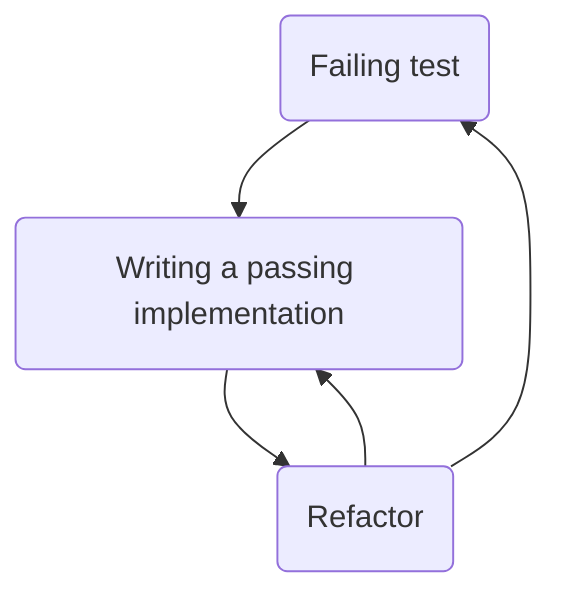

## Coding guidelines ##
### Naming conventions: 
- keyToValue for maps
### TDD
- I have followed TDD to create the code for the restaurant challenge and precisely I have followed the bellow points :

* ### Test only one behavior per test ###

* ### Red-Green- Refactor ###
We first, write a failed test, then we write a passing implementation, then we refactor both the test and the code.

* ### The Given/When/Then ###
Each test method contains three parts indented with an empty line between each part : 
   > * __Given__ : pre-conditions of a test 
   > * __When__ : the behavior that a method tests, and I have respected the best practice to test only one behavior per method 
   > * __Then__ : pos-conditions of our test
